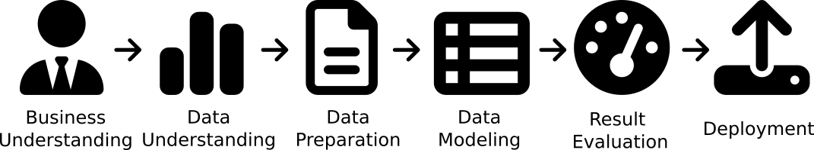

# Udacity Data Science Nanodegree - Data Science Blogpost
## Young people survey
This project was created wile taking the Udacity Data Science Nanodegree. Here the task was to create a a blogpost for a data science project. The data for this project is a "Young People Survey" dataset provided by Kaggle:
https://www.kaggle.com/datasets/miroslavsabo/young-people-survey

This was a survey conducted by students of a statistics class in the UK. It contains responses about personal habbits, hobbies, demographics and health situation. 

## CRISP DM Data Science Process
FDor this course we try to follow the CRISP DM Data Science Process as shown below. It stands for Cross Industry Data Science Process for Data Mining and includes the following steps:
* Business Understanding
* Data Understanding
* Data Preparation
* Data Modeling
* Result Evaluation
* Deployment

## Dataset
As described above we are using a dataset from Kaggle. For this training we did some extensions to the dataset in 
order to better organize it:
1. In the columns.csv a third column was added to categorize the columns. This is used for example for better overview
2. We have added some dummy rows with null values so that we can test the filling options.

The survey that was conducted consisted of several questions:
### MUSIC PREFERENCES
1. I enjoy listening to music.: Strongly disagree 1-2-3-4-5 Strongly agree (integer)
2. I prefer.: Slow paced music 1-2-3-4-5 Fast paced music (integer)
3. Dance, Disco, Funk: Don't enjoy at all 1-2-3-4-5 Enjoy very much (integer)
4. Folk music: Don't enjoy at all 1-2-3-4-5 Enjoy very much (integer)
5. Country: Don't enjoy at all 1-2-3-4-5 Enjoy very much (integer)
6. Classical: Don't enjoy at all 1-2-3-4-5 Enjoy very much (integer)
7. Musicals: Don't enjoy at all 1-2-3-4-5 Enjoy very much (integer)
8. Pop: Don't enjoy at all 1-2-3-4-5 Enjoy very much (integer)
9. Rock: Don't enjoy at all 1-2-3-4-5 Enjoy very much (integer)
10. Metal, Hard rock: Don't enjoy at all 1-2-3-4-5 Enjoy very much (integer)
11. Punk: Don't enjoy at all 1-2-3-4-5 Enjoy very much (integer)
12. Hip hop, Rap: Don't enjoy at all 1-2-3-4-5 Enjoy very much (integer)
13. Reggae, Ska: Don't enjoy at all 1-2-3-4-5 Enjoy very much (integer)
14. Swing, Jazz: Don't enjoy at all 1-2-3-4-5 Enjoy very much (integer)
15. Rock n Roll: Don't enjoy at all 1-2-3-4-5 Enjoy very much (integer)
16. Alternative music: Don't enjoy at all 1-2-3-4-5 Enjoy very much (integer)
17. Latin: Don't enjoy at all 1-2-3-4-5 Enjoy very much (integer)
18. Techno, Trance: Don't enjoy at all 1-2-3-4-5 Enjoy very much (integer)
19. Opera: Don't enjoy at all 1-2-3-4-5 Enjoy very much (integer)

### MOVIE PREFERENCES
1. I really enjoy watching movies.: Strongly disagree 1-2-3-4-5 Strongly agree (integer)
2. Horror movies: Don't enjoy at all 1-2-3-4-5 Enjoy very much (integer)
3. Thriller movies: Don't enjoy at all 1-2-3-4-5 Enjoy very much (integer)
4. Comedies: Don't enjoy at all 1-2-3-4-5 Enjoy very much (integer)
5. Romantic movies: Don't enjoy at all 1-2-3-4-5 Enjoy very much (integer)
6. Sci-fi movies: Don't enjoy at all 1-2-3-4-5 Enjoy very much (integer)
7. War movies: Don't enjoy at all 1-2-3-4-5 Enjoy very much (integer)
8. Tales: Don't enjoy at all 1-2-3-4-5 Enjoy very much (integer)
9. Cartoons: Don't enjoy at all 1-2-3-4-5 Enjoy very much (integer)
10. Documentaries: Don't enjoy at all 1-2-3-4-5 Enjoy very much (integer)
11. Western movies: Don't enjoy at all 1-2-3-4-5 Enjoy very much (integer)
12. Action movies: Don't enjoy at all 1-2-3-4-5 Enjoy very much (integer)

### HOBBIES & INTERESTS
1. History: Not interested 1-2-3-4-5 Very interested (integer)
2. Psychology: Not interested 1-2-3-4-5 Very interested (integer)
3. Politics: Not interested 1-2-3-4-5 Very interested (integer)
4. Mathematics: Not interested 1-2-3-4-5 Very interested (integer)
5. Physics: Not interested 1-2-3-4-5 Very interested (integer)
6. Internet: Not interested 1-2-3-4-5 Very interested (integer)
7. PC Software, Hardware: Not interested 1-2-3-4-5 Very interested (integer)
8. Economy, Management: Not interested 1-2-3-4-5 Very interested (integer)
9. Biology: Not interested 1-2-3-4-5 Very interested (integer)
10. Chemistry: Not interested 1-2-3-4-5 Very interested (integer)
11. Poetry reading: Not interested 1-2-3-4-5 Very interested (integer)
12. Geography: Not interested 1-2-3-4-5 Very interested (integer)
13. Foreign languages: Not interested 1-2-3-4-5 Very interested (integer)
14. Medicine: Not interested 1-2-3-4-5 Very interested (integer)
15. Law: Not interested 1-2-3-4-5 Very interested (integer)
16. Cars: Not interested 1-2-3-4-5 Very interested (integer)
17. Art: Not interested 1-2-3-4-5 Very interested (integer)
18. Religion: Not interested 1-2-3-4-5 Very interested (integer)
19. Outdoor activities: Not interested 1-2-3-4-5 Very interested (integer)
20. Dancing: Not interested 1-2-3-4-5 Very interested (integer)
21. Playing musical instruments: Not interested 1-2-3-4-5 Very interested (integer)
22. Poetry writing: Not interested 1-2-3-4-5 Very interested (integer)
23. Sport and leisure activities: Not interested 1-2-3-4-5 Very interested (integer)
24. Sport at competitive level: Not interested 1-2-3-4-5 Very interested (integer)
25. Gardening: Not interested 1-2-3-4-5 Very interested (integer)
26. Celebrity lifestyle: Not interested 1-2-3-4-5 Very interested (integer)
27. Shopping: Not interested 1-2-3-4-5 Very interested (integer)
28. Science and technology: Not interested 1-2-3-4-5 Very interested (integer)
29. Theatre: Not interested 1-2-3-4-5 Very interested (integer)
30. Socializing: Not interested 1-2-3-4-5 Very interested (integer)
31. Adrenaline sports: Not interested 1-2-3-4-5 Very interested (integer)
32. Pets: Not interested 1-2-3-4-5 Very interested (integer)

### PHOBIAS
1. Flying: Not afraid at all 1-2-3-4-5 Very afraid of (integer)
2. Thunder, lightning: Not afraid at all 1-2-3-4-5 Very afraid of (integer)
3. Darkness: Not afraid at all 1-2-3-4-5 Very afraid of (integer)
4. Heights: Not afraid at all 1-2-3-4-5 Very afraid of (integer)
5. Spiders: Not afraid at all 1-2-3-4-5 Very afraid of (integer)
6. Snakes: Not afraid at all 1-2-3-4-5 Very afraid of (integer)
7. Rats, mice: Not afraid at all 1-2-3-4-5 Very afraid of (integer)
8. Ageing: Not afraid at all 1-2-3-4-5 Very afraid of (integer)
9. Dangerous dogs: Not afraid at all 1-2-3-4-5 Very afraid of (integer)
10. Public speaking: Not afraid at all 1-2-3-4-5 Very afraid of (integer)

### HEALTH HABITS
1. Smoking habits: Never smoked - Tried smoking - Former smoker - Current smoker (categorical)
2. Drinking: Never - Social drinker - Drink a lot (categorical)
3. I live a very healthy lifestyle.: Strongly disagree 1-2-3-4-5 Strongly agree (integer)

### PERSONALITY TRAITS, VIEWS ON LIFE & OPINIONS
1. I take notice of what goes on around me.: Strongly disagree 1-2-3-4-5 Strongly agree (integer)
2. I try to do tasks as soon as possible and not leave them until last minute.: Strongly disagree 1-2-3-4-5 Strongly agree (integer)
3. I always make a list so I don't forget anything.: Strongly disagree 1-2-3-4-5 Strongly agree (integer)
4. I often study or work even in my spare time.: Strongly disagree 1-2-3-4-5 Strongly agree (integer)
5. I look at things from all different angles before I go ahead.: Strongly disagree 1-2-3-4-5 Strongly agree (integer)
6. I believe that bad people will suffer one day and good people will be rewarded.: Strongly disagree 1-2-3-4-5 Strongly agree (integer)
7. I am reliable at work and always complete all tasks given to me.: Strongly disagree 1-2-3-4-5 Strongly agree (integer)
8. I always keep my promises.: Strongly disagree 1-2-3-4-5 Strongly agree (integer)
9. I can fall for someone very quickly and then completely lose interest.: Strongly disagree 1-2-3-4-5 Strongly agree (integer)
10. I would rather have lots of friends than lots of money.: Strongly disagree 1-2-3-4-5 Strongly agree (integer)
11. I always try to be the funniest one.: Strongly disagree 1-2-3-4-5 Strongly agree (integer)
12. I can be two faced sometimes.: Strongly disagree 1-2-3-4-5 Strongly agree (integer)
13. I damaged things in the past when angry.: Strongly disagree 1-2-3-4-5 Strongly agree (integer)
14. I take my time to make decisions.: Strongly disagree 1-2-3-4-5 Strongly agree (integer)
15. I always try to vote in elections.: Strongly disagree 1-2-3-4-5 Strongly agree (integer)
16. I often think about and regret the decisions I make.: Strongly disagree 1-2-3-4-5 Strongly agree (integer)
17. I can tell if people listen to me or not when I talk to them.: Strongly disagree 1-2-3-4-5 Strongly agree (integer)
18. I am a hypochondriac.: Strongly disagree 1-2-3-4-5 Strongly agree (integer)
19. I am emphatetic person.: Strongly disagree 1-2-3-4-5 Strongly agree (integer)
20. I eat because I have to. I don't enjoy food and eat as fast as I can.: Strongly disagree 1-2-3-4-5 Strongly agree (integer)
21. I try to give as much as I can to other people at Christmas.: Strongly disagree 1-2-3-4-5 Strongly agree (integer)
22. I don't like seeing animals suffering.: Strongly disagree 1-2-3-4-5 Strongly agree (integer)
23. I look after things I have borrowed from others.: Strongly disagree 1-2-3-4-5 Strongly agree (integer)
24. I feel lonely in life.: Strongly disagree 1-2-3-4-5 Strongly agree (integer)
25. I used to cheat at school.: Strongly disagree 1-2-3-4-5 Strongly agree (integer)
26. I worry about my health.: Strongly disagree 1-2-3-4-5 Strongly agree (integer)
27. I wish I could change the past because of the things I have done.: Strongly disagree 1-2-3-4-5 Strongly agree (integer)
28. I believe in God.: Strongly disagree 1-2-3-4-5 Strongly agree (integer)
29. I always have good dreams.: Strongly disagree 1-2-3-4-5 Strongly agree (integer)
30. I always give to charity.: Strongly disagree 1-2-3-4-5 Strongly agree (integer)
31. I have lots of friends.: Strongly disagree 1-2-3-4-5 Strongly agree (integer)
32. Timekeeping.: I am often early. - I am always on time. - I am often running late. (categorical)
33. Do you lie to others?: Never. - Only to avoid hurting someone. - Sometimes. - Everytime it suits me. (categorical)
34. I am very patient.: Strongly disagree 1-2-3-4-5 Strongly agree (integer)
35. I can quickly adapt to a new environment.: Strongly disagree 1-2-3-4-5 Strongly agree (integer)
36. My moods change quickly.: Strongly disagree 1-2-3-4-5 Strongly agree (integer)
37. I am well mannered and I look after my appearance.: Strongly disagree 1-2-3-4-5 Strongly agree (integer)
38. I enjoy meeting new people.: Strongly disagree 1-2-3-4-5 Strongly agree (integer)
39. I always let other people know about my achievements.: Strongly disagree 1-2-3-4-5 Strongly agree (integer)
40. I think carefully before answering any important letters.: Strongly disagree 1-2-3-4-5 Strongly agree (integer)
41. I enjoy childrens' company.: Strongly disagree 1-2-3-4-5 Strongly agree (integer)
42. I am not afraid to give my opinion if I feel strongly about something.: Strongly disagree 1-2-3-4-5 Strongly agree (integer)
43. I can get angry very easily.: Strongly disagree 1-2-3-4-5 Strongly agree (integer)
44. I always make sure I connect with the right people.: Strongly disagree 1-2-3-4-5 Strongly agree (integer)
45. I have to be well prepared before public speaking.: Strongly disagree 1-2-3-4-5 Strongly agree (integer)
46. I will find a fault in myself if people don't like me.: Strongly disagree 1-2-3-4-5 Strongly agree (integer)
47. I cry when I feel down or things don't go the right way.: Strongly disagree 1-2-3-4-5 Strongly agree (integer)
48. I am 100% happy with my life.: Strongly disagree 1-2-3-4-5 Strongly agree (integer)
49. I am always full of life and energy.: Strongly disagree 1-2-3-4-5 Strongly agree (integer)
50. I prefer big dangerous dogs to smaller, calmer dogs.: Strongly disagree 1-2-3-4-5 Strongly agree (integer)
51. I believe all my personality traits are positive.: Strongly disagree 1-2-3-4-5 Strongly agree (integer)
52. If I find something the doesn't belong to me I will hand it in.: Strongly disagree 1-2-3-4-5 Strongly agree (integer)
53. I find it very difficult to get up in the morning.: Strongly disagree 1-2-3-4-5 Strongly agree (integer)
54. I have many different hobbies and interests.: Strongly disagree 1-2-3-4-5 Strongly agree (integer)
55. I always listen to my parents' advice.: Strongly disagree 1-2-3-4-5 Strongly agree (integer)
56. I enjoy taking part in surveys.: Strongly disagree 1-2-3-4-5 Strongly agree (integer)
57. How much time do you spend online?: No time at all - Less than an hour a day - Few hours a day - Most of the day (categorical)

### SPENDING HABITS
1. I save all the money I can.: Strongly disagree 1-2-3-4-5 Strongly agree (integer)
2. I enjoy going to large shopping centres.: Strongly disagree 1-2-3-4-5 Strongly agree (integer)
3. I prefer branded clothing to non branded.: Strongly disagree 1-2-3-4-5 Strongly agree (integer)
4. I spend a lot of money on partying and socializing.: Strongly disagree 1-2-3-4-5 Strongly agree (integer)
5. I spend a lot of money on my appearance.: Strongly disagree 1-2-3-4-5 Strongly agree (integer)
6. I spend a lot of money on gadgets.: Strongly disagree 1-2-3-4-5 Strongly agree (integer)
7. I will hapilly pay more money for good, quality or healthy food.: Strongly disagree 1-2-3-4-5 Strongly agree (integer)

### DEMOGRAPHICS
1. Age: (integer)
2. Height: (integer)
3. Weight: (integer)
4. How many siblings do you have?: (integer)
5. Gender: Female - Male (categorical)
6. I am: Left handed - Right handed (categorical)
7. Highest education achieved: Currently a Primary school pupil - Primary school - Secondary school - College/Bachelor degree (categorical)
8. I am the only child: No - Yes (categorical)
9. I spent most of my childhood in a: City - village (categorical)
10. I lived most of my childhood in a: house/bungalow - block of flats (categorical)

## Business Question
Since this is a dataset that is not really business related ḿ we have to think about artificial business questions. For this we will imagine that we are a greedy sportswear company and we are interested in the following topics:

### Predict spending habbits
Here we want to predict what factors (personal traits, habbits, hobbies or demographics) can predict if a person is spending a lot of money on gadgets (Since we want to sell a lot of them and want
to address exactly those people with the right advertisement)?

### Predict healthy lifestyle
Just by looking at people it is hard to predict if someone lives a healthy lifestyle. But we are interested in selling our newest nutrition and vitamine products. 

### Christmas sellings
Christmas is coming up and we want to target people that are likely to spend a lot of money on gifts. Since we know the hobbies, movie and music preferences of our customers (don't ask mey why we know this)
we want to predict which ones are likely to buy lots of presents for their loved ones.

## Files
In this project you will find a couple of files. 
* data: In this folder you will find the source data as can also be downloaded from kaggle
* images: Images that are used in this documentation as well as in the final blog post
* src: Python sources that contain helper functions to be used in the Jupyter Notebook
